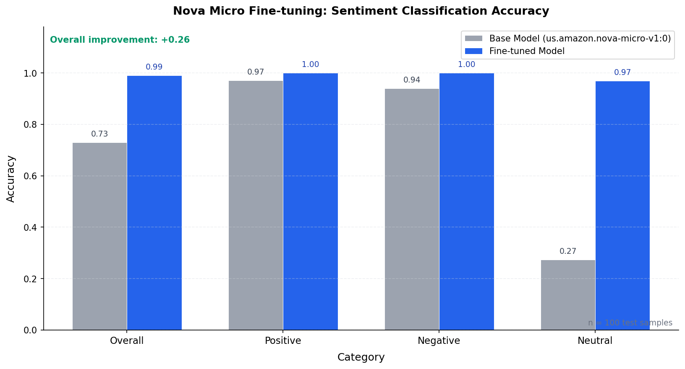

# Amazon Nova Forge 실험: 한국어 감성 분류 Fine-tuning

Amazon Bedrock Nova Micro 모델을 한국어 감성 분류 태스크에 맞게 SFT (Supervised Fine-Tuning) 하고,
베이스 모델 대비 성능 개선을 정량적으로 측정하는 실험입니다.

## 실험 개요

| 항목 | 내용 |
|------|------|
| **베이스 모델** | `amazon.nova-micro-v1:0:128k` |
| **추론 모델 ID** | `us.amazon.nova-micro-v1:0` (inference profile) |
| **Customization** | SFT (FINE_TUNING) |
| **태스크** | 한국어 리뷰 감성 분류 (positive / negative / neutral) |
| **학습 데이터** | 합성 데이터 500개 (train) + 100개 (val) |
| **테스트 데이터** | 100개 (8개 도메인, 혼합 감성 30% 포함) |
| **하이퍼파라미터** | epoch=3, batch_size=1, lr=1e-5 |
| **리전** | us-east-1 |
| **AWS Profile** | profile2 |

## 프로젝트 구조

```
nova-forge/
├── README.md                          # 본 문서
├── scripts/
│   ├── generate_data.py               # 합성 학습 데이터 생성
│   ├── setup_infra.sh                 # AWS 인프라 설정 (IAM + S3)
│   ├── upload_data.sh                 # S3 데이터 업로드
│   ├── run_finetune.py                # Fine-tuning Job 제출
│   ├── monitor_job.py                 # Job 상태 모니터링
│   ├── evaluate.py                    # Before/After 평가
│   ├── visualize.py                   # 결과 시각화 (독립 실행)
│   └── cleanup_infra.sh              # 리소스 정리
├── data/
│   ├── train.jsonl                    # 학습 데이터 (500개)
│   ├── val.jsonl                      # 검증 데이터 (100개)
│   └── test.jsonl                     # 테스트 데이터 (100개)
└── results/
    ├── eval_results.json              # 평가 결과 JSON
    └── accuracy_comparison.png        # 정확도 비교 바 차트
```

## 실행 절차

### Step 1: AWS 인프라 설정

S3 버킷과 IAM Role을 생성합니다.

```bash
# IAM Role (NovaForgeExperimentRole) + S3 버킷 생성
./scripts/setup_infra.sh

# 학습/검증 데이터 S3 업로드
./scripts/upload_data.sh

# (선택) 업로드 전 dry-run으로 확인
./scripts/upload_data.sh --dry-run
```

생성되는 리소스:
- S3 버킷: `nova-forge-experiment-{account_id}`
- IAM Role: `NovaForgeExperimentRole` (Bedrock trust policy)
- IAM Policy: `NovaForgeExperimentPolicy` (S3 + Bedrock + CloudWatch)

### Step 2: (선택) 베이스 모델 사전 평가

Fine-tuning 전 베이스 모델의 성능을 먼저 측정합니다.

```bash
python scripts/evaluate.py --base-only
```

결과 파일:
- `results/eval_results.json` - 베이스 모델 정확도
- `results/accuracy_comparison.png` - 바 차트 (베이스만)

### Step 3: Fine-tuning Job 제출

```bash
# Dry-run: 파라미터 확인만 (API 호출 없음)
python scripts/run_finetune.py --dry-run

# 실제 제출
python scripts/run_finetune.py
```

주요 파라미터:
```json
{
  "baseModelIdentifier": "amazon.nova-micro-v1:0:128k",
  "customizationType": "FINE_TUNING",
  "hyperParameters": {
    "epochCount": "3",
    "batchSize": "1",
    "learningRate": "0.00001"
  }
}
```

### Step 4: Job 모니터링

```bash
# 최신 Job 상태 확인
python scripts/monitor_job.py

# 특정 Job ARN 조회
python scripts/monitor_job.py --job-arn <JOB_ARN>

# 60초 간격 자동 모니터링 (완료/실패 시 자동 종료)
python scripts/monitor_job.py --watch

# 전체 Job 목록
python scripts/monitor_job.py --list
```

### Step 5: Custom Model Deployment 생성

Fine-tuning 완료 후, 커스텀 모델로 추론하려면 배포(Deployment)가 필요합니다.
Provisioned Throughput은 별도 쿼터 신청이 필요하므로, **Custom Model Deployment (on-demand)** 를 사용합니다.

```bash
# 커스텀 모델 ARN 확인
aws bedrock list-custom-models \
  --region us-east-1 \
  --profile profile2

# Custom Model Deployment 생성 (on-demand, PT 쿼터 불필요)
aws bedrock create-custom-model-deployment \
  --model-deployment-name "nova-micro-sentiment-deploy" \
  --model-arn <CUSTOM_MODEL_ARN> \
  --region us-east-1 \
  --profile profile2

# 배포 상태 확인 (Active까지 ~3분)
aws bedrock get-custom-model-deployment \
  --custom-model-deployment-identifier <DEPLOYMENT_ARN> \
  --region us-east-1 \
  --profile profile2
```

> **비용 주의**: Deployment는 사용 시간 동안 과금됩니다. 평가 완료 후 반드시 삭제하세요.

### Step 6: Before/After 비교 평가

```bash
# 베이스 + 커스텀 모델 동시 평가 (Deployment ARN 사용)
python scripts/evaluate.py --custom-model-arn <DEPLOYMENT_ARN>

# 기존 결과로 시각화만 재생성
python scripts/evaluate.py --results-only results/eval_results.json

# visualize.py 단독 실행
python scripts/visualize.py
```

### Step 7: 리소스 정리

```bash
# Custom Model Deployment 삭제 (비용 중요!)
aws bedrock delete-custom-model-deployment \
  --custom-model-deployment-identifier <DEPLOYMENT_ARN> \
  --region us-east-1 \
  --profile profile2

# 커스텀 모델 삭제
aws bedrock delete-custom-model \
  --model-identifier <CUSTOM_MODEL_ARN> \
  --region us-east-1 \
  --profile profile2

# AWS 인프라 정리 (S3 + IAM)
./scripts/cleanup_infra.sh

# (dry-run으로 삭제 대상 확인)
./scripts/cleanup_infra.sh --dry-run
```

## 학습 데이터 형식

Nova 모델은 Converse API 형식의 JSONL을 요구합니다 (다른 Bedrock 모델과 형식이 다름).

```json
{
  "system": [{"text": "You are a sentiment classification assistant."}],
  "messages": [
    {
      "role": "user",
      "content": [{"text": "다음 리뷰의 감성을 positive, negative, neutral 중 하나로 분류하세요.\n\n리뷰: 배송이 빠르고 포장도 깔끔했어요"}]
    },
    {
      "role": "assistant",
      "content": [{"text": "positive"}]
    }
  ]
}
```

### 데이터 분포

| 분할 | positive | negative | neutral | 합계 |
|------|----------|----------|---------|------|
| train | 167 | 167 | 166 | 500 |
| val | 34 | 33 | 33 | 100 |
| test | 34 | 33 | 33 | 100 |

### 도메인 (8개)

쇼핑몰, 음식점, 영화, 숙박, 전자제품, 의류, 뷰티, 배달앱

### 난이도

- 명확한 감성: ~70% (예: "정말 맛있었어요")
- 혼합/미묘 감성: ~30% (예: "맛은 괜찮은데 가격이 너무 비싸요")

## 비용

| 항목 | 비용 |
|------|------|
| Fine-tuning (Nova Micro, 500 samples, 3 epochs, ~4h) | 확인 필요 |
| Custom Model Deployment (평가 시간 ~10분) | 확인 필요 |
| S3 저장 (~200KB) | 무시 가능 |
| Converse API (베이스 모델 200 calls) | ~$0.02 |

> 정확한 비용은 [AWS Bedrock 요금 페이지](https://aws.amazon.com/bedrock/pricing/) 및 AWS Cost Explorer에서 확인

## Fine-tuning 지원 모델 (us-east-1 기준)

| 모델 ID | 지원 Customization | 비고 |
|---------|-------------------|------|
| `amazon.nova-micro-v1:0:128k` | FINE_TUNING, DISTILLATION | 가장 저렴 |
| `amazon.nova-lite-v1:0:300k` | FINE_TUNING, DISTILLATION | 멀티모달 |
| `amazon.nova-pro-v1:0:300k` | FINE_TUNING, DISTILLATION | 고성능 |
| `amazon.nova-2-lite-v1:0:256k` | FINE_TUNING | Nova 2 세대 |
| `amazon.nova-canvas-v1:0` | FINE_TUNING | 이미지 생성 |

## 실험 결과

### 베이스 모델 평가 (Before)

| 클래스 | 정확도 | 정답/전체 |
|--------|--------|----------|
| **Overall** | **73.0%** | 73/100 |
| Positive | 97.1% | 33/34 |
| Negative | 93.9% | 31/33 |
| Neutral | **27.3%** | 9/33 |

**분석**: 베이스 Nova Micro는 positive/negative 분류는 우수하지만, **neutral 분류가 27.3%로 매우 낮음**.
이는 모델이 neutral 리뷰를 positive 또는 negative로 오분류하는 경향이 있음을 시사합니다.

### Fine-tuning Job 결과

| 항목 | 값 |
|------|-----|
| **소요 시간** | **4시간 13분** (프로비저닝 ~3.5h + 학습 ~48m) |
| Custom Model ARN | `arn:aws:bedrock:us-east-1:658492570831:custom-model/amazon.nova-micro-v1:0:128k/w10vam0yqppc` |
| Training Loss | -1.0 (Bedrock 내부 메트릭) |
| Validation Loss | -1.0 (Bedrock 내부 메트릭) |
| 학습 시작 | 2026-03-13 04:55 UTC |
| 학습 완료 | 2026-03-13 05:43 UTC |

### Fine-tuned 모델 평가 (After)

| 클래스 | 정확도 | 정답/전체 | 개선폭 |
|--------|--------|----------|--------|
| **Overall** | **99.0%** | 99/100 | **+26.0%p** |
| Positive | 100.0% | 34/34 | +2.9%p |
| Negative | 100.0% | 33/33 | +6.1%p |
| Neutral | **96.97%** | 32/33 | **+69.7%p** |

**분석**: Fine-tuning 효과가 극적입니다. 특히 neutral 분류가 27.3% -> 97.0%로 **69.7%p 개선**되었습니다.
Positive/Negative는 각각 100%로 완벽한 정확도를 달성했습니다.

### 정확도 비교



```
====================================================
  Evaluation Summary  (n=100)
====================================================
Category             Base   Fine-tuned
----------------------------------------------------
  Overall          0.7300       0.9900  (+0.2600)
  Positive         0.9706       1.0000  (+0.0294)
  Negative         0.9394       1.0000  (+0.0606)
  Neutral          0.2727       0.9697  (+0.6970)
====================================================
```

## 참고 자료

- [PEFT 가이드: LoRA에서 Nova Forge까지](https://jesamkim.github.io/ai-tech-blog/posts/2026-03-11-peft-guide-lora-to-nova-forge/) - 블로그 포스트
- [Amazon Bedrock Custom Models](https://docs.aws.amazon.com/bedrock/latest/userguide/custom-models.html) - AWS 공식 문서
- [Amazon Nova Fine-tuning Guide](https://docs.aws.amazon.com/nova/latest/userguide/customize-fine-tune.html) - Nova 전용 문서
